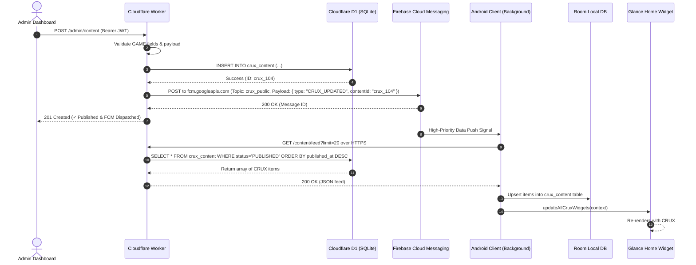

# CRUX — Public Backend Migration Plan

> **STATUS: ARCHITECTURAL & MIGRATION BLUEPRINT ONLY (NO CODE OR CLOUD DEPLOYMENT EXECUTED)**  
> **Target Cloud Stack**: Cloudflare Workers + Cloudflare D1 (Serverless SQLite) + FCM Spark Plan  
> **Budget Constraint**: Strict ₹0 / $0 Cost & Cardless Hard-Stop Security Guarantee

---

## 1. Executive Summary & Architecture Transition

```mermaid
flowchart TD
    subgraph CurrentLocal["Current Local-First MVP (LAN Only - ₹0)"]
        AdminLocal["Admin Dashboard (Browser)"] -->|POST /admin/content| NodeLocal["Local Node.js Server (192.168.1.7:3000)"]
        NodeLocal --> StoreLocal[("local_content_store.json")]
        AndroidLocal["Android App (Nothing Phone)"] -->|GET /content/feed| NodeLocal
        AndroidLocal --> RoomLocal[("Room Local SQLite DB")]
        RoomLocal --> WidgetLocal["Glance Home Screen Widget"]
    end

    subgraph TargetPublic["Target Public Production Architecture (100% Free Tier)"]
        AdminPub["Admin Dashboard (HTTPS / GitHub Pages)"] -->|POST /admin/content (JWT Auth)| CFWorker["Cloudflare Worker (Serverless API)"]
        CFWorker --> CFD1[("Cloudflare D1 (Serverless SQLite DB)")]
        CFWorker -->|FCM Push Signal: CRUX_UPDATED| FCMPush["Firebase Cloud Messaging (Spark Free Tier)"]
        FCMPush -->|Push Signal| AndroidPub["CRUX Android Apps (Global)"]
        AndroidPub -->|HTTPS GET /content/feed| CFWorker
        AndroidPub --> RoomPub[("Room Local SQLite DB")]
        RoomPub --> WidgetPub["Glance Home Screen Widget"]
    end
```

---

## 2. API Mapping & Endpoints

To ensure **100% backwards compatibility**, the Cloudflare Worker API will implement the exact endpoint signatures used by the local Express server.

| Method | Local Endpoint | Target Worker Endpoint | Access Control | Purpose |
| :--- | :--- | :--- | :--- | :--- |
| `GET` | `/content/latest` | `https://crux-api.utcrux.workers.dev/content/latest` | Public | Retrieves latest published CRUX card for single widget |
| `GET` | `/content/feed` | `https://crux-api.utcrux.workers.dev/content/feed?limit=20` | Public | Retrieves array of recent published items for app & widget |
| `GET` | `/content/:id` | `https://crux-api.utcrux.workers.dev/content/:id` | Public | Retrieves specific CRUX card details |
| `GET` | `/content/category/:cat` | `https://crux-api.utcrux.workers.dev/content/category/:cat` | Public | Filter content by category (e.g. `ANNOUNCEMENT`, `GAME`) |
| `POST` | `/admin/content` | `https://crux-api.utcrux.workers.dev/admin/content` | Admin (JWT) | Validates, stores new CRUX/MCQ in D1, & dispatches FCM signal |
| `PUT` | `/admin/content/:id` | `https://crux-api.utcrux.workers.dev/admin/content/:id` | Admin (JWT) | Updates existing CRUX content record |
| `DELETE` | `/admin/content/:id` | `https://crux-api.utcrux.workers.dev/admin/content/:id` | Admin (JWT) | Deletes content record from D1 |
| `POST` | `/auth/login` | `https://crux-api.utcrux.workers.dev/auth/login` | Public | Authenticates admin username/password & returns signed JWT |

---

## 3. Cloudflare D1 Database Schema

Cloudflare D1 uses SQLite, directly mirroring our local Room DB structure.

```sql
CREATE TABLE IF NOT EXISTS crux_content (
    id TEXT PRIMARY KEY NOT NULL,
    type TEXT NOT NULL DEFAULT 'CRUX', -- 'CRUX', 'GAME', 'QUOTE', 'FACT', 'QUESTION'
    title TEXT NOT NULL,
    body TEXT NOT NULL,
    short_text TEXT,
    author TEXT DEFAULT 'CRUX by UTCRUX',
    category TEXT DEFAULT 'GENERAL',
    image_url TEXT,
    status TEXT NOT NULL DEFAULT 'PUBLISHED', -- 'DRAFT', 'SCHEDULED', 'PUBLISHED', 'ARCHIVED'
    priority INTEGER DEFAULT 0,
    visibility TEXT DEFAULT 'PUBLIC',
    published_at TEXT NOT NULL, -- ISO-8601 Timestamp UTC
    scheduled_at TEXT,
    created_at TEXT NOT NULL,
    expires_at TEXT,
    
    -- MCQ Game Fields (Strict NULL defaults for standard CRUX items)
    question TEXT,
    options TEXT, -- Comma-separated string (e.g. "8, 10, 12, 16")
    correct_answer TEXT,
    explanation TEXT,
    points INTEGER DEFAULT 10
);

-- Optimization Indexes
CREATE INDEX IF NOT EXISTS idx_crux_status_published ON crux_content(status, published_at DESC);
CREATE INDEX IF NOT EXISTS idx_crux_category ON crux_content(category);
```

---

## 4. Security & Authentication Architecture

1. **Admin Authentication**:
   - Admin logs in via `/auth/login` with username & secret.
   - Cloudflare Worker validates credentials against secrets bound in Worker Environment Variables (`ADMIN_USER`, `ADMIN_HASH`, `JWT_SECRET`).
   - Returns a signed JWT token valid for 24 hours.
   - All `/admin/*` routes require header `Authorization: Bearer <JWT_TOKEN>`.
2. **Zero Secret Leaks in Frontend & Client**:
   - Admin credentials and JWT secrets remain strictly stored in Cloudflare Worker encrypted secrets (`wrangler secret put`).
   - The Android APK contains **ZERO** admin credentials, Cloudflare API tokens, or FCM server keys.
   - The Android client only uses public read endpoints (`GET /content/feed`).

---

## 5. FCM Push Signal & Global Content Sync Flow

### Live Publish Flow Sequence



---

## 6. Resilience, Fallback & Edge Case Matrix

| Scenario / Failure Case | System Behavior & Fallback | User Experience |
| :--- | :--- | :--- |
| **FCM Push Fails** | Worker logs warning; content remains published in D1. | Android receives content via periodic `WorkManager` fallback catchup. |
| **Device Offline / No Internet** | Android app catches network error; skips sync. | Home widget displays cached content from Room DB. Zero blank widgets. |
| **Network Reconnects** | Android `WorkManager` detects network connectivity restoration. | Silent background sync fetches new content from Worker API & updates widget. |
| **Cloudflare D1 Unavailable** | Worker catches DB error; returns cached response or 503 HTTP error. | App retains local Room DB entries; widget remains functional. |
| **Duplicate FCM Message** | Android compares received `contentId` & `published_at` against Room DB. | Skips redundant database writes & duplicate game scoring. |
| **Out-of-Order Delivery** | Room DB orders items strictly by `published_at DESC`. | Latest published CRUX always ranks first regardless of arrival sequence. |

---

## 7. Cost-Safety & Free-Tier Guardrails

| Cloud Service | Provider Free Allowance | What Counts as Usage | What Happens at Free Limit? | Credit Card Required? | Overage Charges | Hard-Stop Safety |
| :--- | :--- | :--- | :--- | :---: | :---: | :---: |
| **Cloudflare Workers** | **100,000 requests / day** | HTTP requests to worker | Returns HTTP 429 Rate Limit | **NO** | **₹0.00** | Hard-stop enabled by default |
| **Cloudflare D1** | **500 MB storage**, 5M read rows/day | Database queries | Queries rejected until reset | **NO** | **₹0.00** | Hard-stop enabled by default |
| **Firebase FCM** | **Unlimited** push notifications | FCM push requests | Throttled if spam threshold hit | **NO** | **₹0.00** | Spark plan hard-stop |

---

## 8. Android & Environment Separation Strategy

### Environment Configuration in Android Client

In `crux-android/app/build.gradle.kts`:

```kotlin
flavorDimensions += "environment"
productFlavors {
    create("local") {
        dimension = "environment"
        buildConfigField("String", "BASE_URL", "\"http://192.168.1.7:3000/\"")
    }
    create("production") {
        dimension = "environment"
        buildConfigField("String", "BASE_URL", "\"https://crux-api.utcrux.workers.dev/\"")
    }
}
```

- **Local Build**: Uses local backend (`192.168.1.7:3000`).
- **Production Build**: Uses Cloudflare Worker URL (`https://crux-api.utcrux.workers.dev/`).
- The entire Android UI, Room DB, Glance Widget, and FCM service logic remain **100% identical** across both environments.

---

## 9. Rollback & Local Fallback Strategy

If production Cloudflare Worker or D1 experiences any unexpected issue:
1. The Android client automatically retains Room DB data locally.
2. The local Node.js Express server remains fully operational at `192.168.1.7:3000`.
3. Switching Android build variant back to `localDebug` reverts the client to local LAN testing instantly.

---

## 10. Manual Action Check-list for Founder (When Cloud Migration is Approved)

> [!NOTE]  
> None of these actions are required right now. They are documented strictly for future reference.

1. **Create Free Cloudflare Account**: Sign up at [dash.cloudflare.com](https://dash.cloudflare.com) (No credit card needed).
2. **Install Wrangler CLI**: Run `npm install -g wrangler` on local PC.
3. **Login Wrangler**: Run `wrangler login` to authorize local development PC.
4. **Create D1 Database**: Run `wrangler d1 create crux-db`.
5. **Set Worker Secret**: Run `wrangler secret put JWT_SECRET` and enter admin secret.
6. **Deploy Worker**: Run `wrangler deploy`.
